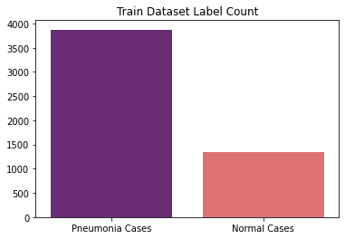
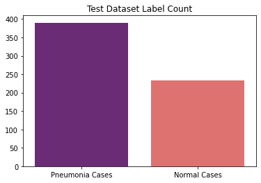
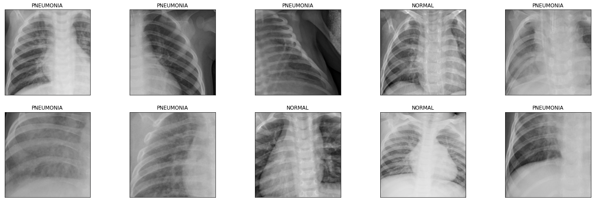
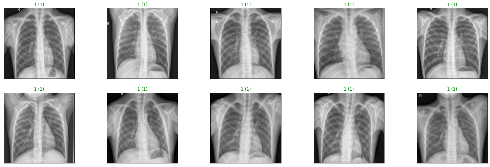
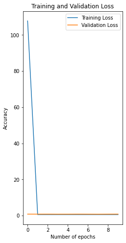
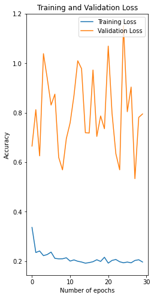
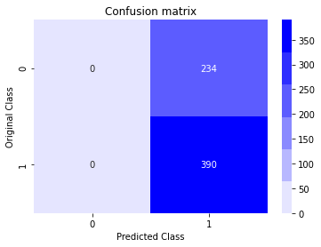
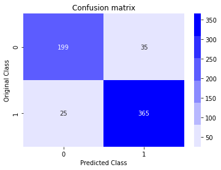

<h1 align="center">Pneumonia Diagnosis from Chest Ray</h1>

## AI in Healthcare

AI in healthcare has a huge scope and the impact you can make in the world. Making a prototype to solve medical problems will always be a big motivation. It’s unbelievable how AI is improving the healthcare field, specifically in medical diagnosis. AI will improve the way doctors diagnose and treat diseases. It’s an opportunity to join forces! This time, detecting Pneumonia in Chest X-Ray images is a great experience. I will show you two approaches to detect Pneumonia in Chest X-Rays: Using a Convolutional Neural Network with PyTorch (It’s my favorite!).

## Problem Statement

The task is to predict if a person has pneumonia or not using Chest X-Ray.

We will train a Convolutional Neural Network (CNN) that is able to detect whether a patient has pneumonia, both bacterial and viral, based on an X-ray image of their chest. We need to classify a patient as either having pneumonia or not having pneumonia. This is a binary classification problem.

(Everything you need to recreate this project is in this [Jupyter notebook](https://colab.research.google.com/drive/1s_2Ti9kjtVqeAUiqDOM4XcCsCA9cAFaA?usp=sharing). Everything was coded in Google Colab, because of its GPU. The code to download the dataset is available in the notebook.)

## Kaggle dataset

**Link**: https://www.kaggle.com/paultimothymooney/chest-xray-pneumonia

The dataset is organized into 3 folders (train, test, validation) and contains subfolders for each image category (Pneumonia/Normal). There are 5,863 X-Ray images (JPEG) and 2 categories (Pneumonia/Normal).

Chest X-ray images (anterior-posterior) were selected from retrospective cohorts of pediatric patients of one to five years old from Guangzhou Women and Children’s Medical Center, Guangzhou. All chest X-ray imaging was performed as part of patients’ routine clinical care.

For the analysis of chest x-ray images, all chest radiographs were initially screened for quality control by removing all low quality or unreadable scans. The diagnoses for the images were then graded by two expert physicians before being cleared for training the AI system. In order to account for any grading errors, the evaluation set was also checked by a third expert.

## Distribution of dataset

The distribution of the datasets are as follows:

**Train Dataset** (_Pneumonia - 3875, Normal - 1341_)  
**Validation Dataset** (_Pneumonia - 8, Normal - 8_)  
**Test Dataset** (_Pneumonia - 390, Normal - 234_)  

  
  
  

## Chest X-ray Images

The following are the illustrative examples of chest x-Rays in patients with pneumonia and normal conditions.

  

## Solution

The first approach was to train a CNN from scratch by arbitrarily selecting the convolution layers and fully connected layers and check the test accuracy. I have defined the following CNN architecture.

  

The first convolution layer will have a kernel size of 3 and stride 2, this will decrease the input image size by half. The second convolution layer will also have a kernel size of 3 and stride 2, which will decrease the input image size by half. The third convolution layer will have a kernel size of 3.

I have applied the max-pooling of stride 2 after each convolution layer to reduce the image size by half. I have also applied Relu activation for each of the convolution layers.

Then, I have flattened the inputs and applied a dropout layer with probability as 0.3. Three fully connected layers are applied with Relu activation and dropout 0.3 to produce the final output that will predict the classes of a chest x-ray.

We will use **Cross-Entropy-Loss** to calculate the loss of a model with **Adam optimizer**.

For this model, we achieved the **test accuracy** of **62.5% (390/624)**.

The second approach was to use transfer learning with CNN using a pre-trained model. We will use the **DenseNet-169** model as it has good performance on Image classification. I have eventually added a final fully connected layer that will output the probabilities of both the classes (i.e. normal or pneumonia).

When we train this model for only 30 epochs with a learning rate of 1e-3 (0.001), we were able to achieve **test accuracy** of **90.38% (564/624)**.

The following are the chest x-rays predictions of the DenseNet model with pneumonia conditions.

  

The following is the training and validation loss of both the models. (_Left - CNN Scratch, Right - CNN Transfer Learning_)

 

The following is the confusion matrix of both the models. (_Left - CNN Scratch, Right - CNN Transfer Learning_)

 

We can see that the initial CNN model tends to predict all the chest x-ray images as pneumonia. However, the accuracy is significantly increased using a pre-trained model.

Through this project, we were able to see the concept of transfer learning, an effective method for object recognition. Instead of training a model from scratch, we can use existing architectures that have been trained on a large dataset and then tune them for our task. This reduces the time to train and often results in better overall performance. The outcome of this project is some knowledge of transfer learning and PyTorch that we can build on to build more complex applications.

## Contributing

Bug reports and pull requests are welcome on GitHub at https://github.com/maanavshah/pneumonia-diagnosis. This project is intended to be a safe, welcoming space for collaboration, and contributors are expected to adhere to the [Contributor Covenant](http://contributor-covenant.org) code of conduct.

## License

The content of this repository is licensed under [MIT LICENSE](LICENSE).

