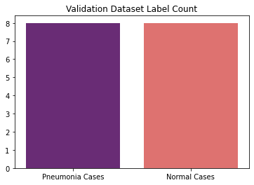
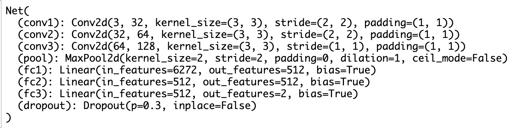

# pneumonia-diagnosis

## AI in Healthcare

AI in healthcare has huge scope and the impact you make in the world, too. Making a prototype to solve medical problems will always be a reason to be proud of. It’s unbelievable how AI is improving the healthcare field, specifically in medical diagnosis. AI will improve the way Doctors diagnose and treat diseases. It’s not a competition but an opportunity to join forces!This time, detecting Pneumonia in Chest X-Ray images, is a great experience. I will show you two ways to detect Pneumonia in Chest X-Rays: Using a Convolutional Neural Network with PyTorch (It’s my favorite!).

## Problem Statement

The task is to predict if a person has pneumonia or not using Chest X-Ray.

We will train a Convolutional Neural Network (CNN) that is able to detect whether a patient has pneumonia, both bacterial and viral, based on an X-ray image of their chest. We need to classify a patient as either having pneumonia or not having pneumonia. This is a binary classification problem.

## Kaggle dataset

**Credits**: Kaggle (https://www.kaggle.com/paultimothymooney/chest-xray-pneumonia)

Content
The dataset is organized into 3 folders (train, test, validation) and contains subfolders for each image category (Pneumonia/Normal). There are 5,863 X-Ray images (JPEG) and 2 categories (Pneumonia/Normal).

Chest X-ray images (anterior-posterior) were selected from retrospective cohorts of pediatric patients of one to five years old from Guangzhou Women and Children’s Medical Center, Guangzhou. All chest X-ray imaging was performed as part of patients’ routine clinical care.

For the analysis of chest x-ray images, all chest radiographs were initially screened for quality control by removing all low quality or unreadable scans. The diagnoses for the images were then graded by two expert physicians before being cleared for training the AI system. In order to account for any grading errors, the evaluation set was also checked by a third expert.

### Distribution of dataset

### Chest X-ray Images

The following are the illustrative examples of chest X-Rays in Patients with normal or pneumonia conditions.

## Solution

We will train a CNN from scratch and check the test accuracy. I have defined the following CNN architecture.

The first convolution layer will have a kernel size of 3 and stride 2, this will decrease the input image size by half. The second convolution layer will also have a kernel size of 3 and stride 2, which will decrease the input image size by half. The third convolution layer will have a kernel size of 3.

I have applied the max-pooling of stride 2 after each convolution layer to reduce the image size by half. I have also applied Relu activation for each of the convolution layers.

Then, I have flattened the inputs and applied a dropout layer with probability as 0.3. Three fully connected layers are applied with Relu activation and dropout 0.3 to produce the final output that will predict the classes of a chest x-ray.

We will use Cross-entropy loss to calculate the loss function and Adam optimizer.

For this model, we achieved the **test accuracy** of **62% (390/624)**.

Now, we will use transfer learning using a DenseNet-169 pre-trained model to create a CNN that will greatly improve the test accuracy. And for this model, for training only 30 epochs, we were able to achieve **test accuracy** of **90% (564/624)**.

The following are the illustrative examples of chest x-Rays predictions of patients with normal or pneumonia conditions.

The following is the training and validation loss of CNN initial model and the transfer learning CNN model.

## Installation

Everything you need to recreate this project is on the jupyter notebook. Everything was coded in Google Colab, because of its GPU. The dataset was uploaded to Google Drive, so you can download it directly (the code to download it is in the notebook). For more details, the notebook includes the instructions to follow.

## Contributing

Bug reports and pull requests are welcome on GitHub at https://github.com/maanavshah/pneumonia-diagnosis. This project is intended to be a safe, welcoming space for collaboration, and contributors are expected to adhere to the [Contributor Covenant](http://contributor-covenant.org) code of conduct.

## License

The content of this repository is licensed under [MIT LICENSE](LICENSE).

